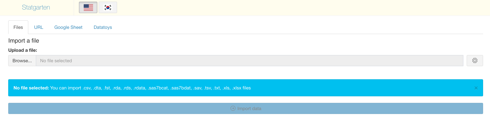
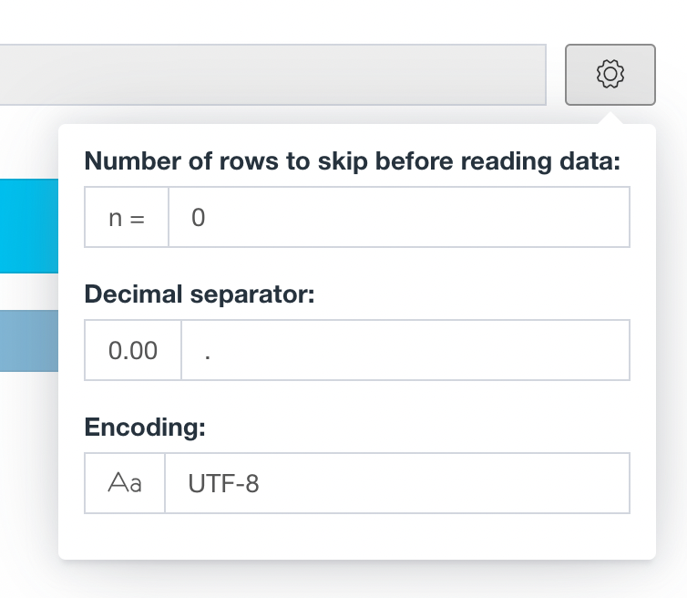
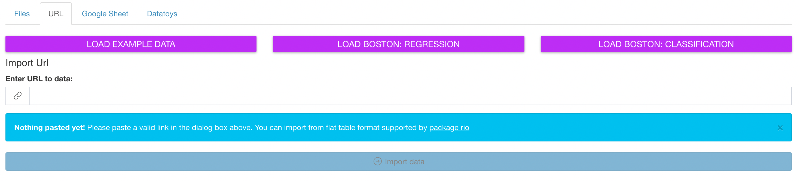
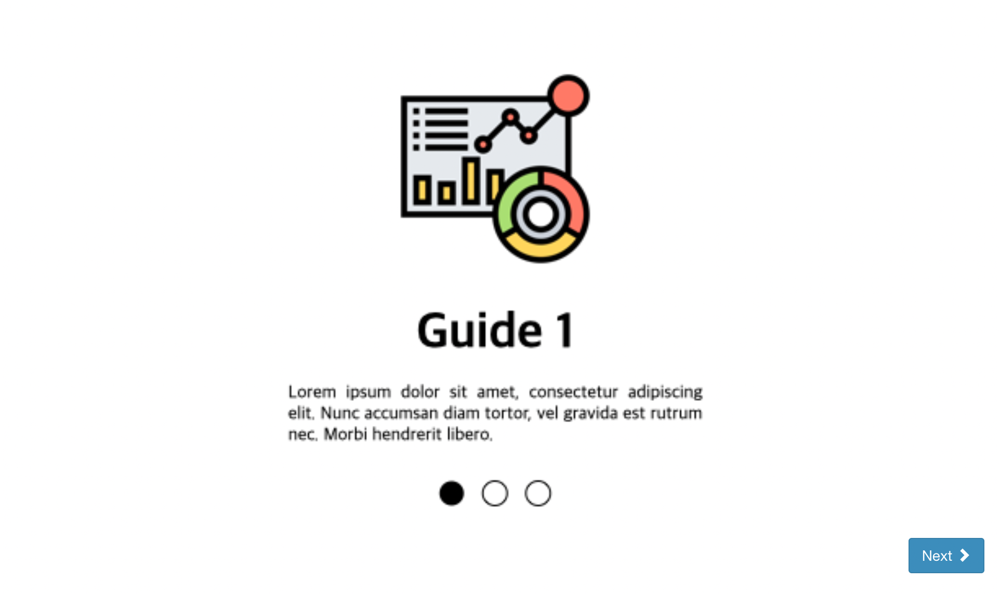
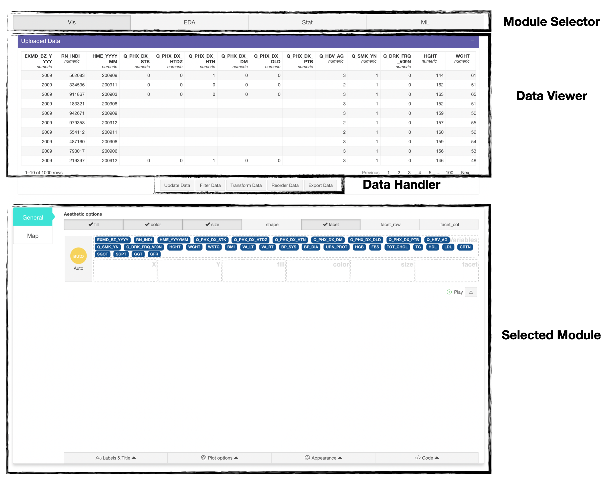
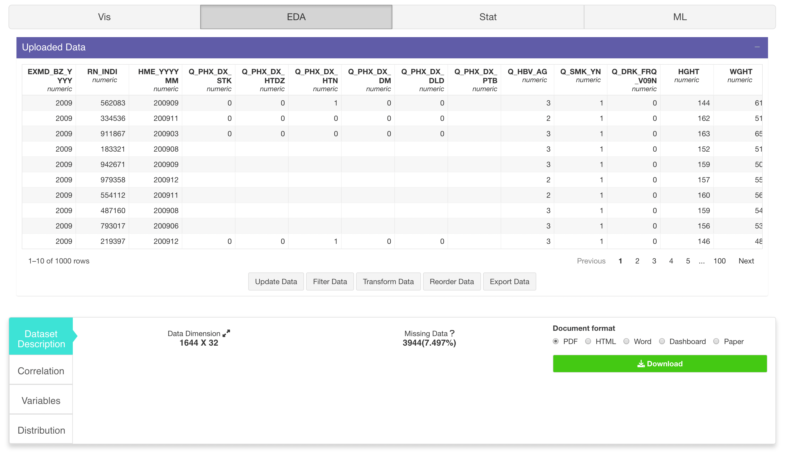
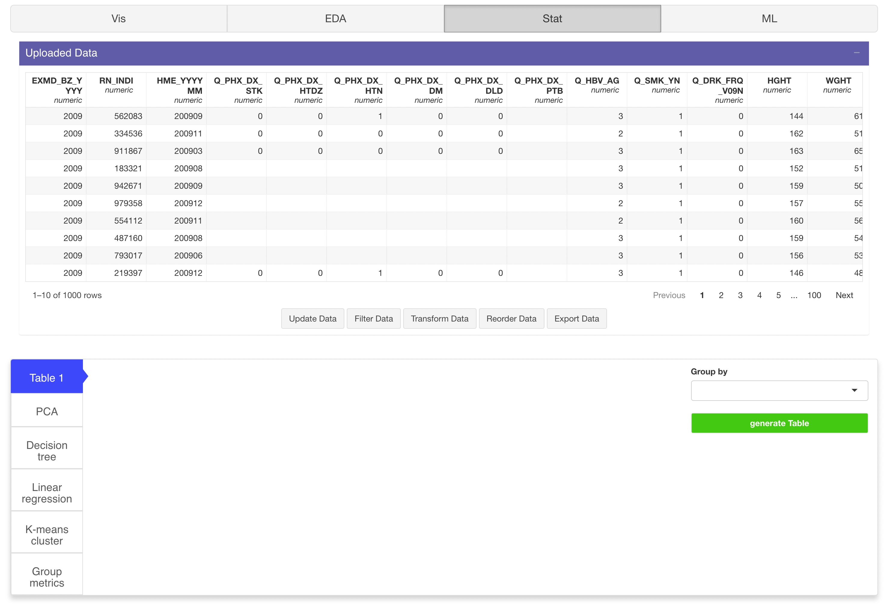
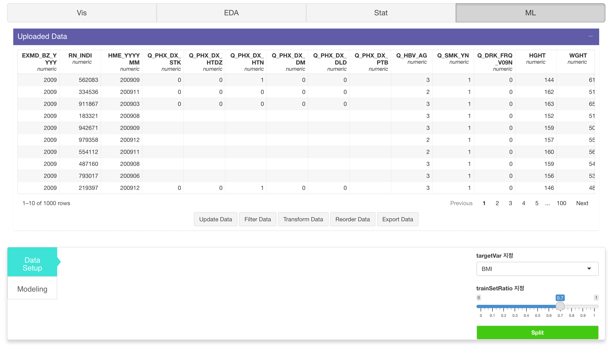
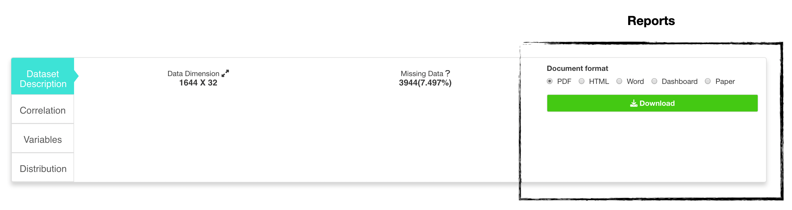
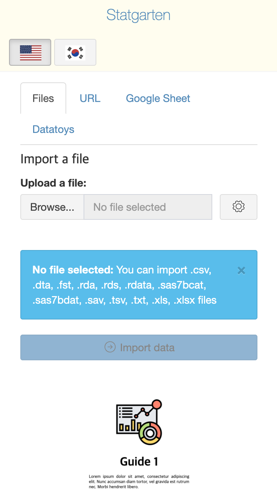

```{r, include = FALSE}
knitr::opts_chunk$set(
  collapse = TRUE,
  comment = "#>"
)
```

## Introduction

`door` is core shiny application of [statgarten](https://www.statgarten.com/statgarten/) for EASY-data analysis.

`door` is consists with 4 + 1 functions. 

1. Data Import
2. Data Visualize (see [colorpen](https://github.com/statgarten/colorpen))
3. Data Profiling (see [board](https://github.com/statgarten/board))
4. Statistical Data analysis (see [soroban](https://github.com/statgarten/soroban))
5. Machine Learning (see [stove](https://github.com/statgarten/stove))

In this article, we introduce how to Import (or upload) dataset for analysis.

This article is based on **0.1.7** Version of door

## Getting Started

When you run door (by `door::run_app()`)

You will see image like below. 



Import part is consisted with 3 part.

1. Language selection: You can choose either english or korean. (some may not support korean yet, let us know by [creating issue](https://github.com/statgarten/door/issues) )

- Other languages may be added in further, but not soon.

- **i** button is designed for guide (it's **experimental**, not usable yet.) 

2. Type of data: door supports 4 types. 
  - Files (Local). You can upload your PC's file by `drag` or clicking `Browse` button.
  - URL (Web). You can paste URL of data.
  - Google Sheet. Also supported, you must check data can be access for public. 
  - [Datatoys](https://github.com/statgarten/datatoys). In case of you don't have any data, statgarten curated Public data from [Public data portal in Republic of Korea](https://www.data.go.kr/). For more information, visit [datatoys repository](https://github.com/statgarten/datatoys)
  
- Also for each type, there are different options.



- In Files, trip, encoding, decimal separator is provided.
- `door` supports 13 type of format.



- In URL, test data exists, (which may removed in further version)

- `door` mainly utilize datamods for data import, so you may interest to [datamods description](https://dreamrs.github.io/datamods/)
  
3. Import module: it changes as user select type of data.
  

**Experimental PART**

4. Guide



Under import module, there's carousel-like component which is consider to provide guide to door user. 

and it's in development process (which may removed or used).

## Exploring Modules



`door` shows 1 + 1 modules for each function.

that is `uploaded Data` (it will show in every module)

and selected module (like Vis) which consisted of tabsetpanels.







## Reports



by using `Dataset Description` function in `EDA` module.

You can download data profile with various format. (content will same)

For more information, you can refer **Report** article

## Module's provided function

`door` utilize other packages include statgarten's and each of them has description for functions.

- Data viewer is just reactable
- See [scissor](https://github.com/statgarten/scissor) and [datamods](https://github.com/dreamRs/datamods) for Data Handler
- See [colorpen](https://github.com/statgarten/colorpen) and [esquisse](https://dreamrs.github.io/esquisse/) for Vis
- See [board](https://github.com/statgarten/board) for EDA
- See [soroban](https://github.com/statgarten/soroban) for Stat
- See [stove](https://github.com/statgarten/stove) for ML

## door for Mobile user.



**We don't recommend** using door with mobile phone (especially for ML since it requires hard computation).

However, you can still use with mobile. some component's layout will not work efficiently but functionality doesn't effected.

## Usecase

See **Usecase** articles. (on process)

---

For any issue or suggestion, please make issue in [door's github](https://github.com/statgarten/door/issues).
